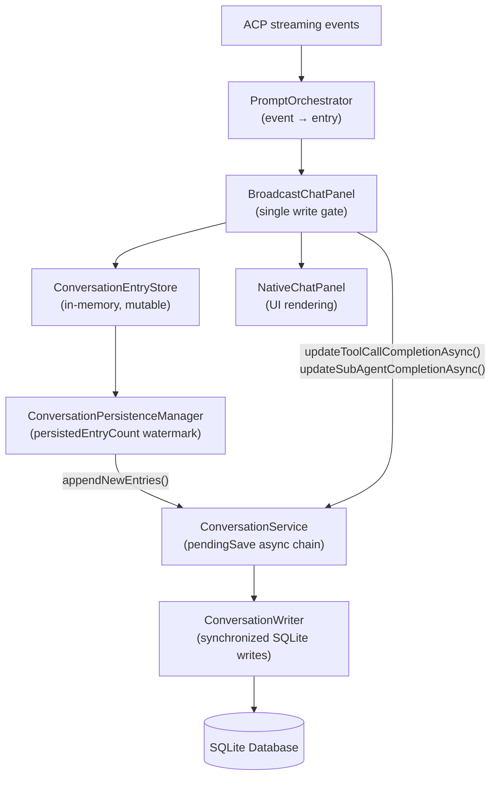

# Conversation Persistence — Trigger Points & Data Guarantees

This document describes when and how conversation entries are written to the SQLite
database, how UUIDs are generated, and what guarantees exist against data loss.

---

## Architecture Overview



---

## UUID Generation

Every entry receives a stable UUID (`entryId`) at creation time. These UUIDs are used
as primary keys in the database and must never change after creation.

| Entry Type       | UUID Source                                                              |
|------------------|--------------------------------------------------------------------------|
| **Prompt**       | ACP `turn_id` from the protocol (or `UUID.randomUUID()` if missing)     |
| **Text**         | `UUID.randomUUID()` — generated on first `appendText()` call            |
| **Thinking**     | `UUID.randomUUID()` — generated on first `appendThinkingText()` call    |
| **ToolCall**     | ACP `tool_call_id` passed via `addToolCallEntry(id, ...)`               |
| **SubAgent**     | ACP `tool_call_id` passed via `addSubAgentEntry(id, ...)`               |
| **TurnStats**    | `UUID.randomUUID()` — generated in `finishTurn()`                       |
| **ContextFiles** | `UUID.randomUUID()` — generated at construction                         |
| **Nudge**        | `UUID.randomUUID()` — generated at construction                         |

**Key rule:** The `entryId` is the database row key (`event_id` in subtype tables,
`id` in the `events` table). Once set, it is immutable. All INSERTs use
`INSERT OR IGNORE` keyed on this ID — duplicate inserts are silently skipped.

---

## Session ID

- Stored in `.agent-work/.current-session-id` (one per project)
- Generated as `UUID.randomUUID()` on first prompt if file is missing
- Reset by `archiveConversation()` (starts a new session)
- The session ID file is the source of truth — same session ID = same conversation

---

## Persistence Trigger Points

### 1. `appendNewEntries()` — Incremental batch save

**Called by:** `ConversationPersistenceManager.appendNewEntries()`
**Triggered from:**
- `PromptOrchestrator.callbacks.saveConversation()` — immediate save (at block boundaries)
- `PromptOrchestrator.callbacks.saveConversationThrottled()` — throttled (30s), on tool call completion
- Turn end / `finishTurn()` — always saves

**What it does:**
1. Reads all entries from `ConversationEntryStore.getEntries()` (thread-safe snapshot)
2. Drops the first `persistedEntryCount` entries (already saved)
3. Passes the remaining entries to `ConversationService.appendEntriesAsync()`
4. Advances `persistedEntryCount` to the current size

**Guarantee:** All entries at indices `[0, persistedEntryCount)` have been queued
for database write. Entries are written in a single transaction per batch.

**Risk:** If an entry is persisted while still in a "running" state (result=null),
and later mutated in-place, the mutation is NOT automatically reflected in the DB.
This is why explicit UPDATE calls exist (see §2 and §3 below).

### 2. `updateToolCallCompletionAsync()` — Explicit result UPDATE

**Called by:** `BroadcastChatPanel.updateToolCall()` when `status != "running"`
**What it does:**
```sql
UPDATE tool_call_events SET
    result        = COALESCE(?, result),
    status        = ?,
    auto_denied   = ?,
    denial_reason = COALESCE(?, denial_reason)
WHERE event_id = ?
```

**Why needed:** If a tool call was INSERT'd early (while running, with null result)
because another tool call completed and triggered `appendNewEntries()`, this UPDATE
ensures the final result is persisted.

**Safe when row doesn't exist:** UPDATE affects 0 rows (no-op). The subsequent
`appendNewEntries()` call (triggered by `saveConversationThrottled`) will INSERT
the entry with correct data from the already-mutated in-memory snapshot.

### 3. `updateSubAgentCompletionAsync()` — Explicit result UPDATE

**Called by:** `BroadcastChatPanel.updateSubAgentResult()` when `status != "running"`
**What it does:**
```sql
UPDATE sub_agent_events SET
    result_text   = COALESCE(?, result_text),
    status        = ?,
    auto_denied   = ?,
    denial_reason = COALESCE(?, denial_reason)
WHERE event_id = ?
```

**Same rationale as §2** — sub-agents are especially affected because their internal
tool calls always trigger intermediate saves, meaning the sub-agent entry is almost
always persisted before its result arrives.

### 4. `enrichToolCallStats()` — MCP metadata UPDATE

**Called by:** `ConversationService.enrichToolCallStats()` (from MCP protocol handler)
**What it does:** Updates `input_size_bytes`, `output_size_bytes`, `duration_ms`,
`success`, `error_message`, `category`, `display_name`, `is_mcp` on a tool call row.

**Triggered when:** The MCP server-side execution completes. This may arrive before
or after the ACP-side completion — both orderings are safe because it uses COALESCE
for nullable fields.

### 5. `markToolCallMcp()` / `markToolCallNonMcp()` — MCP correlation flag

**Called by:** MCP protocol handler when correlation is confirmed/denied.
**What it does:** Sets `is_mcp = 1` or `is_mcp = 0` on the tool call row.

### 6. `recordHookStages()` / `recordHookExecution()` — Hook audit records

**Called by:** Hook execution pipeline after tool permission/pre/post hooks run.
**What it does:** INSERT rows into `hook_executions` table, linked to the tool call's
`event_id`.

---

## Entry Lifecycle by Type

### Text Entries

```
appendText("chunk1") → creates EntryData.Text(raw="chunk1", entryId=UUID)
appendText("chunk2") → mutates in-place: raw="chunk1chunk2"
...
closeCurrentTextEntry() → sets _currentText=null (next appendText creates fresh entry)
appendNewEntries()      → persists the text entry with its FINAL content
```

**Guarantee:** Text entries are always persisted with their complete content because:
1. `closeCurrentTextEntry()` is called before any block boundary that saves
2. The save captures the current `raw` value at snapshot time
3. No subsequent mutation occurs after close

**Do we ever UPDATE text entries?** No. Once persisted, a text entry's content is
final. If more text arrives, it goes into a NEW entry (fresh UUID). This is because
`closeCurrentTextEntry()` is called at block boundaries (before tool calls, before
saves), ensuring the persisted text represents a complete segment.

**Acceptable loss window:** If the plugin crashes mid-stream (between the last
`appendText()` and the next `closeCurrentTextEntry()` + save), the current text
entry may be lost. This is the accepted level of loss documented in requirements.

### Tool Call Entries

```
addToolCallEntry(id, title, args, kind) → creates EntryData.ToolCall(status=null)
[appendNewEntries() may fire here due to other completions — INSERT with null result]
updateToolCall(id, "completed", {details="..."})
  → mutates in-memory: status="completed", result="..."
  → fires UPDATE SQL (updateToolCallCompletionAsync) ← NEW
  → triggers saveConversationThrottled → appendNewEntries()
```

**Guarantee:** After the fix, tool call results are always persisted because:
1. The explicit UPDATE fires immediately on completion (chained through pendingSave)
2. Even if the INSERT happened earlier with null result, the UPDATE overwrites it
3. `COALESCE(?, result)` means a null UPDATE param preserves existing data

### Sub-Agent Entries

```
addSubAgentEntry(id, type, desc, prompt) → creates EntryData.SubAgent(status=running)
[internal tool calls fire → appendNewEntries() persists sub-agent with null result]
updateSubAgentResult(id, "completed", result="Found 3 files")
  → mutates in-memory: status="completed", result="Found 3 files"
  → fires UPDATE SQL (updateSubAgentCompletionAsync) ← NEW
  → triggers saveConversationThrottled → appendNewEntries()
```

**Same guarantee as tool calls** — the explicit UPDATE ensures results survive.

### TurnStats Entries

```
finishTurn(stats) → creates EntryData.TurnStats(turnId=UUID)
appendNewEntries() → persists as UPDATE to the turns table (ended_at, tokens, etc.)
```

**Guarantee:** TurnStats is always final at creation time (no mutation). Persisted
on the immediate save after turn completion.

### Nudge Entries

```
addNudgeEntry(id, text, source) → creates EntryData.Nudge(sent=true)
appendNewEntries() → persists via INSERT
```

**Guarantee:** Only `sent=true` nudges are persisted. Pending nudges (user hasn't
confirmed) are transient UI state.

---

## Ordering Guarantees

All writes go through `ConversationService.pendingSave` — a `CompletableFuture` chain
that ensures strict ordering:

```
pendingSave = pendingSave.thenRunAsync(write1)
pendingSave = pendingSave.thenRunAsync(write2)
// write2 always executes after write1
```

This guarantees:
- An INSERT (from `appendNewEntries()`) always completes before any subsequent UPDATE
  (from `updateToolCallCompletionAsync`) for the same entry
- Multiple concurrent `appendNewEntries()` calls are serialized
- The completion UPDATE cannot race ahead of the initial INSERT

---

## Dispose / Shutdown

`ConversationService.dispose()` calls `awaitPendingSave(3000)` — waits up to 3 seconds
for pending writes to flush. This is sufficient for normal shutdown since individual
SQLite writes are fast (< 100ms typically).

**Risk:** If the plugin is forcibly killed (kill -9, crash), any writes still in the
`pendingSave` queue are lost. This is acceptable — the same data would be lost in any
asynchronous write system.

---

## What Can Go Wrong (After Fix)

| Scenario                              | Data Loss?    | Why                                                              |
|---------------------------------------|---------------|------------------------------------------------------------------|
| Plugin crashes mid-text-stream        | Partial text  | Accepted: current text entry not yet saved                       |
| Plugin crashes after tool completion  | No            | UPDATE is queued immediately; `awaitPendingSave` on dispose       |
| IDE force-killed during write         | Possible      | SQLite journal provides crash recovery for committed transactions |
| Two tool calls racing                 | No            | UPDATE fires for EACH completion independently                   |
| Sub-agent with 50 internal tools      | No            | UPDATE fires when sub-agent completes, after all INSERTs         |
| `enrichToolCallStats` races INSERT    | No            | Both use `event_id` as key; UPDATE on missing row = 0 affected   |
| Restore after crash (partial session) | Partial turns | Last uncommitted transaction is rolled back by SQLite journal     |

---

## Summary: All Write Trigger Points

| Method                                  | Source                          | Operation   | Target Table          |
|-----------------------------------------|---------------------------------|-------------|-----------------------|
| `recordEntries()`                       | `appendNewEntries()` pipeline   | INSERT      | sessions, turns, events, text_events, thinking_events, tool_call_events, sub_agent_events, nudge_events, turn_context_files, commits |
| `updateToolCallCompletion()`            | `BroadcastChatPanel.updateToolCall()` | UPDATE | tool_call_events (result, status)                                    |
| `updateSubAgentCompletion()`            | `BroadcastChatPanel.updateSubAgentResult()` | UPDATE | sub_agent_events (result_text, status)                         |
| `enrichToolCallStats()`                 | MCP protocol handler            | UPDATE      | tool_call_events (stats, category, display_name)                     |
| `markToolCallMcp()` / `markToolCallNonMcp()` | MCP correlation logic     | UPDATE      | tool_call_events (is_mcp flag)                                       |
| `recordHookStages()` / `recordHookExecution()` | Hook pipeline           | INSERT      | hook_executions                                                      |
| `updateTurnTotals()` (via TurnStats)    | `recordEntries()` pipeline      | UPDATE      | turns (ended_at, tokens, cost, etc.)                                 |
| `updateSessionEndedAt()`                | `recordEntries()` pipeline      | UPDATE      | sessions (ended_at)                                                  |
| `updateSessionDisplayName()`            | `recordEntries()` (first prompt)| UPDATE      | sessions (display_name, only if NULL)                                |
