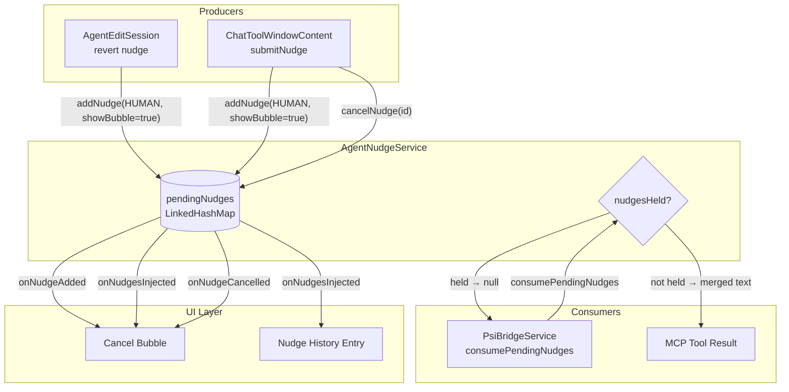
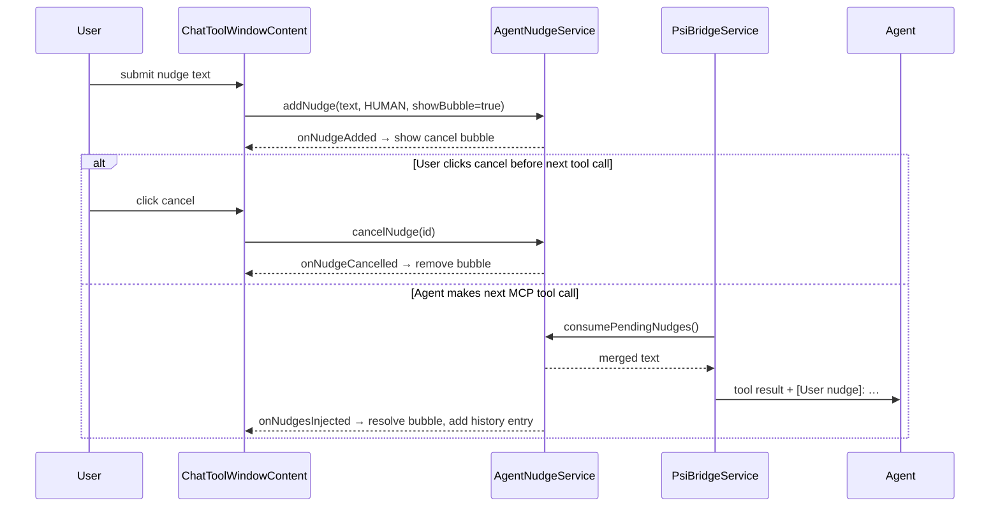

# Agent Nudge Architecture

Nudges are short-lived instructions injected into the next MCP tool result to steer the agent's
behaviour mid-turn — either because the user explicitly typed one, or because the user declined or
reverted an agent edit and the plugin wants to tell the agent what happened.

---

## Components

| Component               | Role                                                                                                                                                                |
|-------------------------|---------------------------------------------------------------------------------------------------------------------------------------------------------------------|
| `AgentNudgeService`     | **Single source of truth.** Owns the pending nudge queue, IDs, coalescing, injection gating, and listener dispatch.                                                 |
| `ChatToolWindowContent` | **UI subscriber + producer.** Registers an `AgentNudgeService.Listener` to manage the cancel-bubble and history entry, and submits HUMAN nudges the user types. Holds only display-layer references (`activeBubbleId`). |
| `AgentEditSession`      | **Revert nudge producer.** Fires a HUMAN nudge when the user declines or reverts an agent edit.                                                                     |
| `PsiBridgeService`      | **Consumer / injector.** Calls `consumePendingNudges()` when returning each MCP tool result, appending the merged text as `[User nudge]: …`.                        |

> **Note on reprimands.** Earlier versions had `CopilotClient` produce a "native tool reprimand"
> nudge whenever the agent called a built-in tool (`bash`, `grep`, `read`…) instead of the MCP
> equivalent. That mechanism has been **removed**: Copilot CLI now honors `--excluded-tools` /
> `--available-tools` in ACP mode, so overlapping built-in tools are excluded outright and the
> agent can no longer call them. The `NATIVE_TOOL_REPRIMAND` and `TOOL_ABUSE_REPRIMAND` values
> survive in the `NudgeSource` enum only so previously persisted conversations still deserialize —
> nothing produces them anymore.

---

## Data model

```
NudgeEntry
  id         String      UUID (e.g. "550e8400-e29b-41d4-a716-446655440000")
  text       String      the instruction text
  source     NudgeSource HUMAN | NATIVE_TOOL_REPRIMAND | TOOL_ABUSE_REPRIMAND
  showBubble boolean     whether the UI should show a cancel bubble
```

`HUMAN` is the only source produced at runtime. The two `*_REPRIMAND` values are **legacy** —
retained for deserializing older persisted conversations (see the note above). HUMAN nudges
**accumulate** (all are kept).

---

## System overview



---

## HUMAN nudge lifecycle

User types an instruction in the nudge input box and submits it (or `AgentEditSession` submits one
on the user's behalf when an edit is reverted).



---

## Coalescing rules

| Source                  | Behaviour on new `addNudge`                                                    |
|-------------------------|--------------------------------------------------------------------------------|
| `HUMAN`                 | All HUMAN nudges kept; merged when consumed.                                    |
| `NATIVE_TOOL_REPRIMAND` | *(legacy, not produced)* Replaces any existing one of the same source.          |
| `TOOL_ABUSE_REPRIMAND`  | *(legacy, not produced)* Replaces any existing one of the same source.          |

The coalescing logic still handles the legacy reprimand sources independently, but no producer
emits them, so in practice only HUMAN nudges flow through the queue.

---

## Injection gating (`nudgesHeld`)

While a **sub-agent** is active, `setNudgesHeld(true)` prevents `consumePendingNudges()` from
returning anything. Nudges queue up silently and are injected into the first tool call after the
main agent resumes (`setNudgesHeld(false)`).

---

## Turn-start cleanup

`CopilotClient.beforeSendPrompt()` calls `clearHumanNudges()` before each turn is sent.
This silently drops any HUMAN nudges that were pending but not delivered (e.g. user submitted a
nudge but no tool call happened to inject it).

`restoreUnhandledNudgeIfNeeded()` in `ChatToolWindowContent` uses the locally-tracked
`pendingHumanText` to restore the user's undelivered text back to the input box — so the user
doesn't lose their manually-typed instruction.

---

## Key invariants

1. **All nudge state lives in `AgentNudgeService`.** The UI holds only `activeBubbleId` (a
   display-layer reference, not the nudge itself).
2. **Callers decide `showBubble` and source** before calling `addNudge`.
3. **Listener callbacks fire synchronously** on the calling thread. UI listeners wrap in
   `ApplicationManager.getApplication().invokeLater(…)`.
4. **`clearHumanNudges()` fires no events.** It is a silent purge — not a cancellation.
5. **`cancelNudge()` fires `onNudgeCancelled`.** It is for explicit user-initiated cancellation
   only (cancel button). Coalescing and turn-start cleanup do not use it.
6. **`activeBubbleId` must only be read and written on the EDT.** `onNudgeAdded` fires from
   a background thread — reading `activeBubbleId` there would race against EDT writes. The
   check for an existing bubble and the update of `activeBubbleId` must both happen inside the
   `invokeLater` block so each queued runnable sees the value written by the previous one.
   Violating this causes multiple bubbles to appear simultaneously (issue #523).
