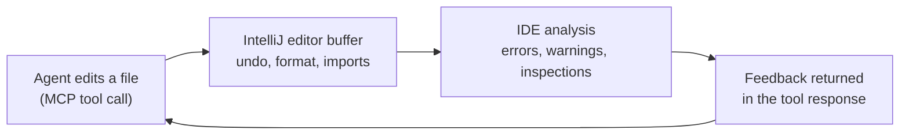

# How IDE feedback reaches the agent

A coding agent that edits files through a terminal only learns about problems when it later builds or runs tests.
AgentBridge routes edits through the IDE so the agent gets the same feedback a developer sees in the editor, while the
change is still fresh.

## The loop

1. The agent calls an edit tool such as `edit_text`, `write_file` or `replace_symbol_body`.
2. The change is applied through IntelliJ's Document API, so it is undoable and integrates with VCS tracking. Formatting
   and import optimization can run as part of the edit.
3. The IDE analyses the file. Errors, warnings and inspection results (including those from plugins such as SonarLint
   or SonarQube for IDE) become available.
4. AgentBridge surfaces that feedback to the agent, in the tool response where possible, so the agent can react while it
   still remembers why it made the change.

The agent can also ask explicitly with tools such as `get_highlights`, `get_problems`, `get_compilation_errors` and
`apply_quickfix`, and it can run builds and tests through the IDE.

## Why it matters

- Mistakes are caught after one edit rather than after a long series of edits.
- Fixes can use IDE quick-fixes and refactorings instead of the model approximating them.
- Long sessions stay more consistent because warnings do not accumulate.

For the longer argument, see [The Case for IDE-Native Coding Agents](../IDE-NATIVE-CODING-AGENTS.md).

Related: [MCP vs ACP](mcp-vs-acp.md) · [Tool reference](../../FEATURES.md)
